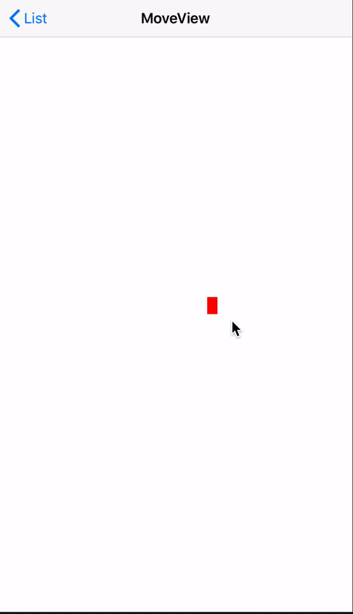
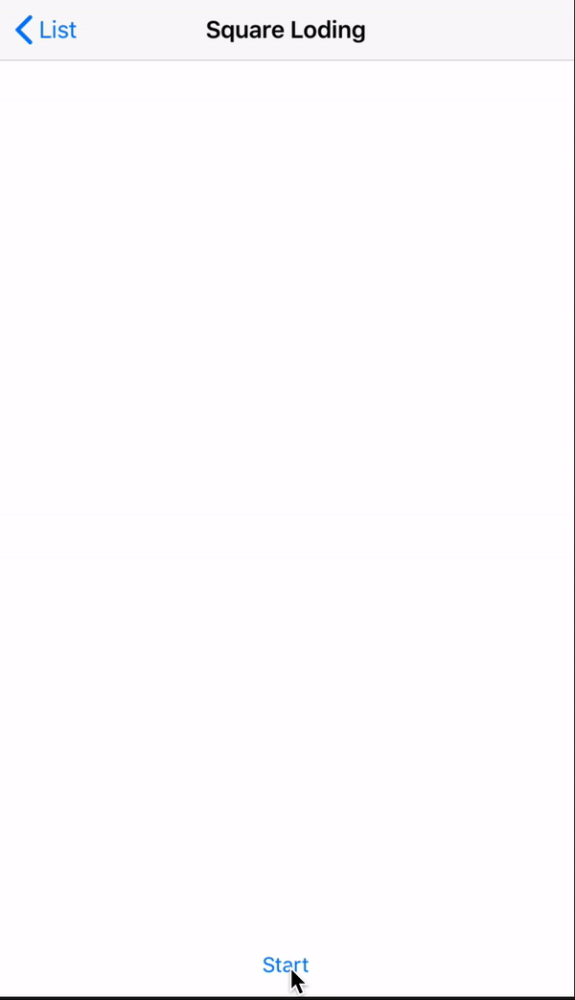
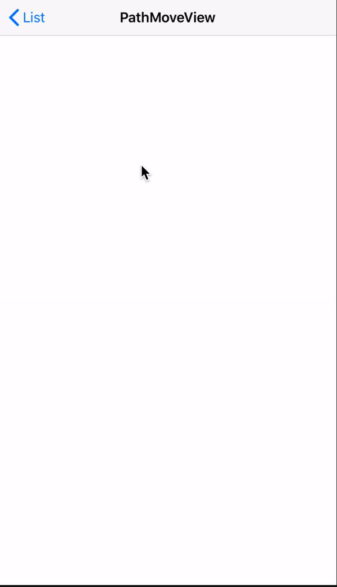

iOS-Animation
===============

## 1. 애니메이션은 왜 필요할까요?
애니메이션이란 것은 있으면 좋지만 없어도 그만이라는 인식이 아직은 많이 남아있습니다.

하지만 단순한 애니메이션 하나라도 사용자에게 보여지는 이미지는 엄청난 차이를 만든다고 생각합니다.

예를 들어 앱에 두가지의 로딩 안내 indicator가 있습니다. 하나는 애니메이션이 동작하는 indicator이며, 하나는 단순히 텍스트로 안내하는 indicator입니다.

 

두 indicator를 사용하는 앱들이 indicator를 제외한 모든 기능이 똑같다고 한다면 사용자들은 어떤 것을 더 선호하게 될까요?

애니메이션은 혼자 동작 할 때가 아닌 앱 안에 자연스럽게 녹아들어 앱을 더욱 빛나게 해주는데 있다고 생각합니다.

그렇기에 애니메이션이 필요하고, 또한 앱 개발자로써 애니메이션을 이해하고 공부하는 것이 필요합니다.

## 2. 애니메이션 예제
* **MoveUIView**

  MoveUIView는 View를 클릭하고 마우스 드래그 시 뷰의 이동과 변화를 주는 예제입니다.
  
  

* **PickAndUniqIcon**

  회사 프로젝트인 픽앤유니크의 아이콘 이미지를 UIBezierPath와 Stroke 애니메이션을 이용해 만들어 본 예제입니다.
  
  
  
* **SquareLoding**

  사각형 레이어 4개를 이용하여 만든 CustomActivityIndicator로 CAKeyframeAnimation의 transform 애니메이션 효과를 이용해 만들어 본 예제입니다.
  
  
  
* **PathMoveView**

  마우스로 그린 경로를 UIBezierPath로 만들어서 CAKeyframeAnimation의 position 애니메이션 효과로 경로를 따라 움직이는 뷰를 만들어 본 예제입니다.

  
